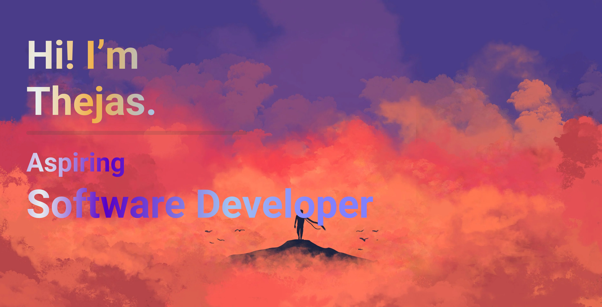

# 💫 About Me:
- 👀 I’m interested in learning new things  
- 🌱 I’m currently [ENTER WHAT YOU ARE DOING]
- 💞️ I’m not looking to collaborate right now, but might be interested later  

## 🌐 Socials:

  
  
  

# 💻 Tech Stack:

  
  
  
  
  
  
  
  
  

## 🏆 GitHub Trophies

  

# 📊 GitHub Stats:

  
  

# 🔥 GitHub Streak:

  

---

  

---
<!-- Proudly created with GPRM ( https://gprm.itsvg.in ) -->
